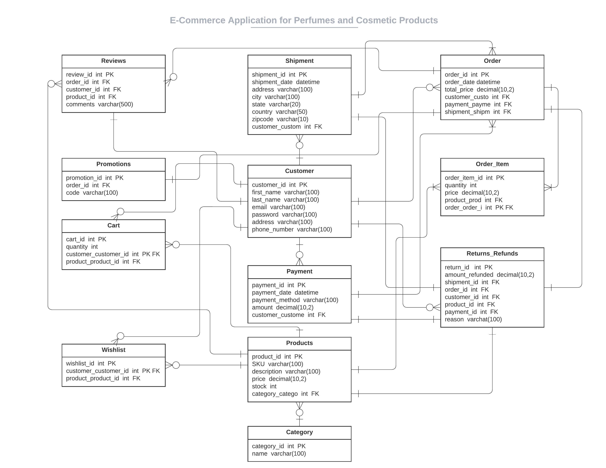
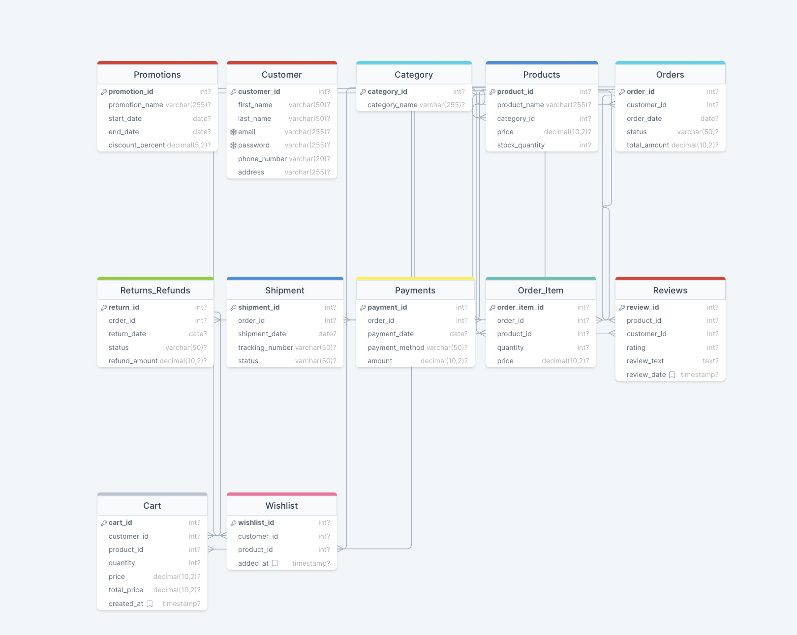

# E-Commerce Application for Perfume and Cosmetic Products

## Team
- Gugan Kathiresan
- Liam Kelly
- Hrisha Yagnik

The "eperfume" database system is a robust platform designed to support operations for an online retail perfume store. 

- This project emphasizes the creation of a strong database schema capable of handling various data types, including customer information, product details, orders, payments, and reviews. 
- With a focus on scalability, integrity, and efficient data retrieval, the system integrates multiple e-commerce features to enhance customer experience.
- The project's database design adheres to normalization principles, eliminating redundancy and ensuring data accuracy. 
- It offers insights into effective, scalable, and user-friendly database systems in the context of e-commerce.


### Tables
- **Promotions Table**
- **Customer Table**
- **Category and Products Table**
- **Purchases and Purchases Order Table**
- **Returns and Refunds Table**
- **Shipment Table**
- **Payments Table**
- **Reviews Table**
- **Cart and Wishlist Table**

### Stored Procedures, Views, Functions, Triggers
- **Stored Procedures:** ReduceStockQuantity, ProcessOrder, RefundOrder
- **Views:** CustomerOrderSummary, ProductSalesReviews
- **Functions:** total sales, is in stock, calculate refund
- **Triggers:** DeleteWishlist


## Code and Files
All code files for this project are categorized into "Python Code" and "DDL and Data Dump" sub-folders.

### Python Code
- **project-ApplicationInterface.py:** Python code for the command-line application interface.
- **project-GraphAnalysis.py:** Python code for generating graphical visualizations.
- **requirements.txt:** Contains library requirements to run the Python application.

### DDL and Data Dump
- **projectDDL.sql:** Initial DDL queries to create tables in the schema.
- **projectDataDump.sql:** SQL code to populate the tables in the database.
- **projectFunctions.sql:** SQL code for creating functions.
- **projectTriggers.sql:** SQL code for creating triggers.
- **projectStoredProcedures.sql:** SQL code for creating stored procedures.
- **projectViews.sql:** SQL code for creating views.

## Application Instructions
To run the application, navigate to the "Python Code" folder in your terminal.
Install the requirments using the code,
   ``` pip install -r requirements.txt ```
Then run the "project-ApplicationInterface.py" file using the code below
   ``` python project-ApplicationInterface.py ```

Future developments can involve sophisticated functions like predictive analytics for stock management, tailored product suggestions, and real-time data updates through external APIs.

## ER and Schema Diagram



## References
- [PyMySQL package](https://pymysql.readthedocs.io/en/latest/)
